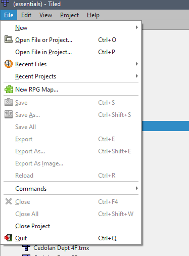
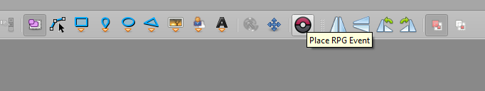

# Pokemon Essentials Template (PET) Project

## Overview
This repo was created as a place to build out a template for developing games with pokemon-essentials. Since essentials is based on the outdated RMXP project struture, it's very difficult to develop with it using modern sensibilities around version control, modularity, and encapsulation of project elements. This template aims to remedy these issues.

The project has following goals:
* Enable development with full version control of all assets
* Maintain all binary elements as de-compiled source files
* Ensure cross-platform compatibility where possible
* Use only open-source tools, ideally build from source in-situ
* Minimize or eliminate the use of RMXP

## Repo Setup

You can copy this repo as is into a new repo using GitHub's template feature. After that, you'll want to clone it to your development machine for setup.

### Prerequisites
A Unix compatible OS. You can run Linux, Mac(probably), or WSL on Windows(recommended). This repo was develop with Ubuntu 22.04 running on WSL2 on Windows 10.
An installation of [Tiled](https://www.mapeditor.org/). (I used the windows version for my WSL setup.)
Download the Pokemon Essentials v21.1 zip file. This contains assets missing from the GitHub repo. You'll have to find this on your own.
Installation of Ruby and Bundler. You may already have this on your machine by default.
Installation of Python3 and Pip. You may already have this on your machine by default.

### Local Setup

On your development machine you'll want to do the following things:
1. Redirect each over the git submodules to your own fork or custom repo. The submodules are described in the [Submodules](#submodules) section.
2. Make sure you init the submodules. "git submodule update --init --recursive"
3. Run "make setup". This will set up your local Ruby and Python environments.
4. Extract the Essentials zip file into the src/essentials folder. Don't overwrite any existing files.
5. Run the game at least once, compile the PBS files, and make sure it's working properly.
6. Run "make backup decompile". This will copy the non-GitHub assets to the src/assets folder, and decompile the Data files to src/data, src/events/, and src/tiled/ folders.
7. Commit the assets files in that submodule and double check the other source files. Git shouldn't see any changes if you're using the example project.
8. Back up the src/essentials files to another folder and run "make distclean". This will delete all the files in src/essentials not tracked by that submodule.
9.  Run "make install compile". This will install the assets from src/assets and compile the other src files back into rxdata files.
10. Run the game in src/essentials, don't forget to hold left-cntrl to compile pbs files. It should run as normal, demonstrating a full compile from source.

### Submodules
src/essentials -- This points to a fork of the pokemon-essentials Github project. It contains the core scripts used by the game engine to run the game.

src/assets -- This points to a private repo containing the various assets from Pokemon Essentials v21.1 that can't be stored in the public pokemon-essentials repo.

tools/eevee -- This points to a fork of the eevee Github project. This tool is used to extract rxdata files into .rb files that can be version controlled and are human readable.

### Existing Projects
If you're converting an existing project, the local setup setup instructions should be compatible, with a few exceptions:
* If you change the fundamental functionality of the essentials project, particularly around maps/events, things will likely break.
* You'll need to be careful on managing the files as the template repo is set up for the demo project.
* The autotiles converter only supports single tile and 3x4 tilesets, it's okay if it's animated.
* There's probably some other things, so user beware.

## Development
After you confirm that the repo is set up properly, you should be (technically) fully capable of making an essentials game without ever opening RMXP.

* To edit maps, including event locations, you can open the tiled project in src/tiled.
* To edit event details, aside from location, edit the specific files in src/events. Note that the events here do contain location info, but during compilation, the map data take precedence.
* You can edit pretty much everything else in the essentials debug menus.

### Adding Maps
There's an extension in the tiled project to create a RMXP compatible map. You can access it under "File > New RPG Map...". This will open a dialog to generate a new map base that can compile into a RMXP map.

Adding events to maps can be done with the custom event tool. You can also just use the event tileset and create the source file manually.

## Notable Missing Features
Currently the essentials animation importer/exporter isn't working correctly on main, so those data files aren't decompiled.

RMXP autotiles are compacted in an unusual way. The converter just builds out a 48 tile set, but doesn't really replicate the behavior in Tiled. This could be done with a modification of the script and/or Tiled's terrain tools in the future. If you really want to use these, for now, you probably want to do it in RMXP.

There's a lot of other quality of life issues like only having one "real" tileset per map, not having intellisense or a gui for the events files, etc.

## Tips
On WSL, you can run "Powershell.exe" from the terminal to open a Powershell session. This lets you run 'Game.exe "debug"' directly from environments like vscode. There are a few scripts in the project root that use this feature.

Windows can access WSL files, but it's usually as a network drive. I set a symoblic link in my WSL home directory to a "projects" directory in an external drive for my development. This helped to make Windows and Linux play nice.
